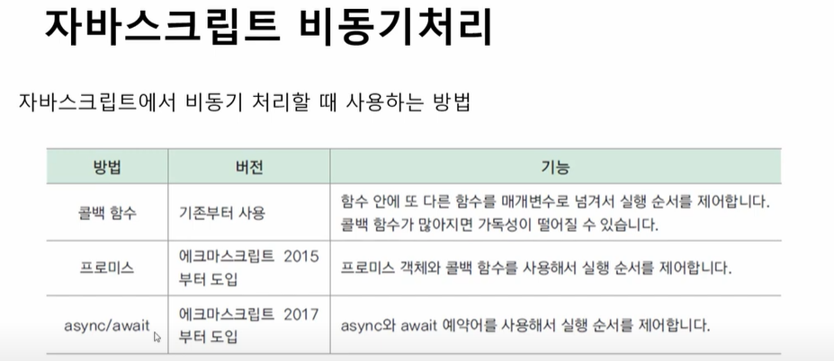

# before-dinner-node
> [npm 사용 패키징 모음](nodejs.org)
- require로 패키징 사용 가능 (CommonJS 모듈 표준)
- ```import c from 'ansi-colors';``` 가능 (ES 모듈 표준)
- Node는 기본적으로 CommonJS 모듈 표준에 따르고 ES 모듈을 제공해주는 것을 원칙으로 한다고는 한다.

(※ function.appy(객체, 배열) / Spread Syntax 대체 가능 (...A) / arguments 유사 배열 활용 가능.)

- 비동기 처리에서 async/await를 활용할 것을 권장
> 

Node Core Moudle
> [Node.js v23.5.0 documentation](https://nodejs.org/docs/latest/api/)
> 
- grobal module : __dirname, __fileName 참고

